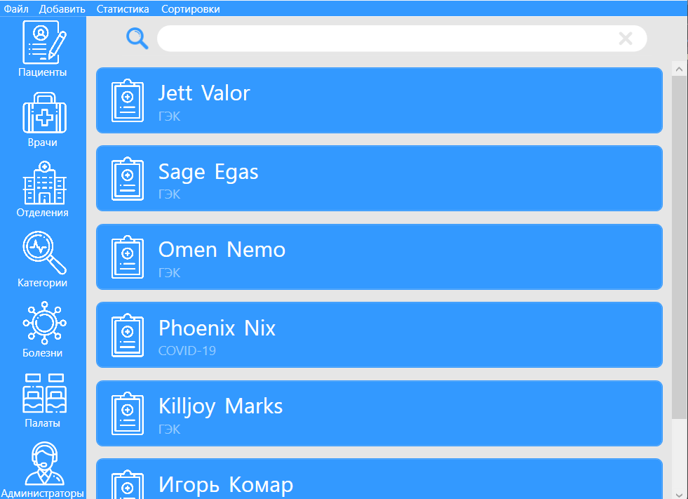
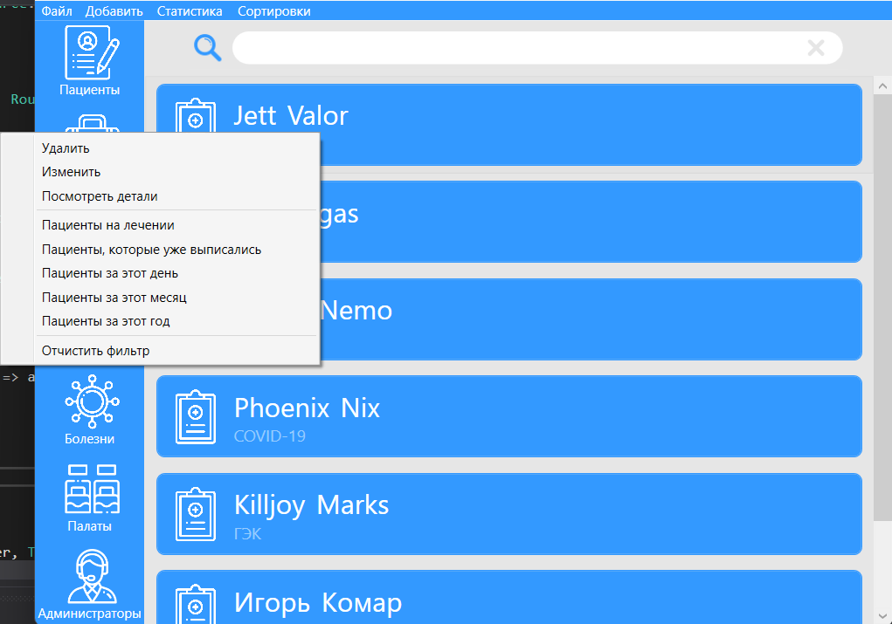
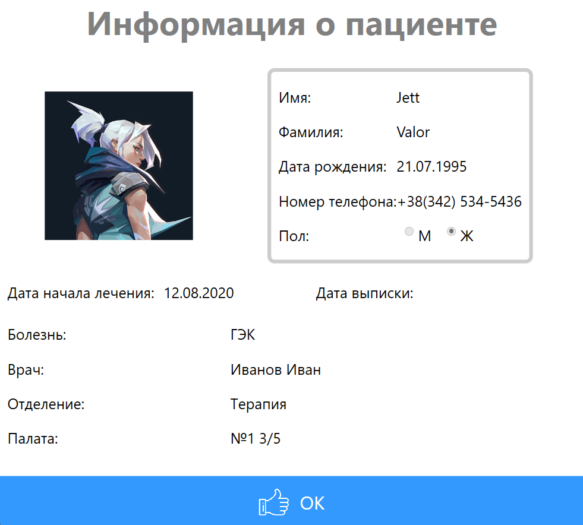
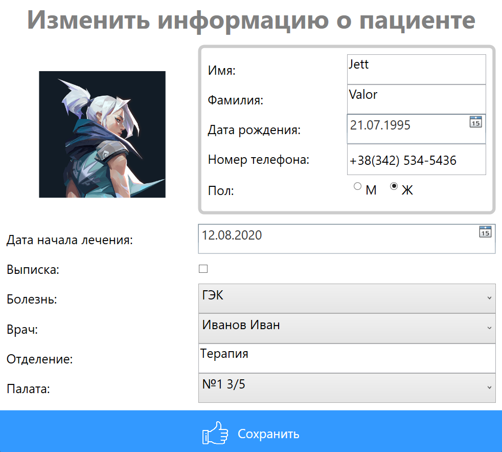
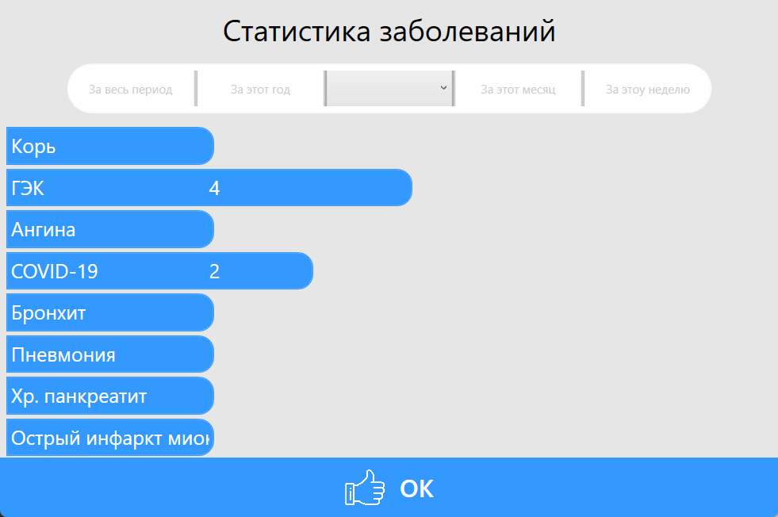

# Hospital App

Додаток для адміністрування лікарняних комплексів, ведення статистики та аналітики захворювань.

## Необхідний софт для роботи програми

[Visual Stodio 2019](https://visualstudio.microsoft.com/ru/vs/) або вище.  
[SQL Server Management Studio](https://docs.microsoft.com/en-us/sql/ssms/download-sql-server-management-studio-ssms?view=sql-server-ver16)

## Як запустити
Відкрийте файл Аpp.config і в блоці connectionStrings поміняйте рядок підключення на свій локальний сервер (зазначений SQL Server Manager)
```bash
 <connectionStrings>
    <add name="FullHospitalDB" connectionString="Data Source=[your computer]\SQLEXPRESS;Integrated Security=true;Initial Catalog=FullHospitalDB" providerName="System.Data.SqlClient"/>
 </connectionStrings>
```
### Авторизація як головний адміністратор
Login: root \
Password: 111 \

## Скріншоти проекту
### Головна сторінка
 \
### Контекстне меню
 \
### Інформація про пацієнта
 \
### Редактор інформація про пацієнта
 \
### Статистика захворювань
